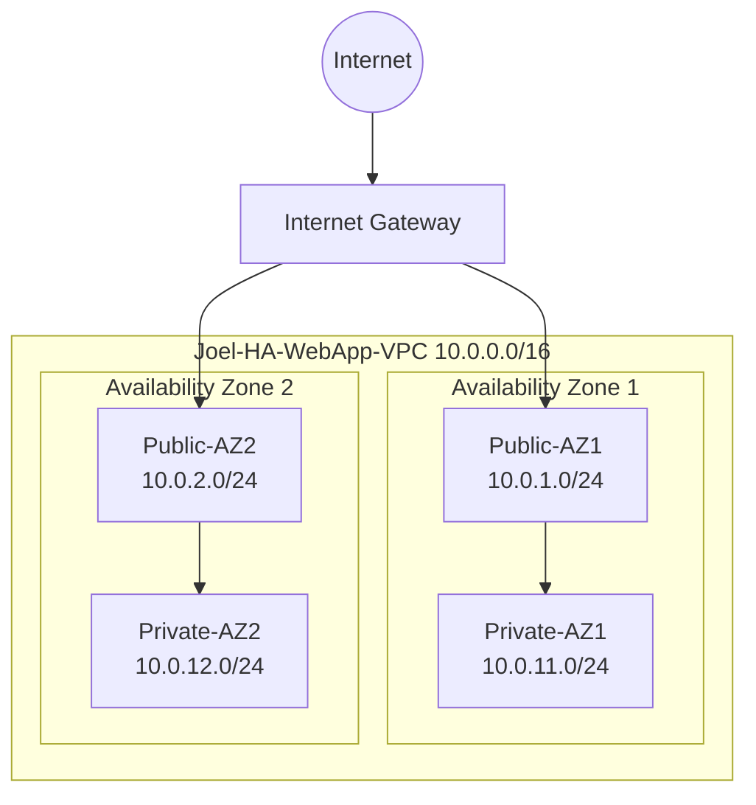

# Project 01 – Highly Available Web Application

## Objective
Design and deploy a highly available web application architecture in AWS using:

- Custom VPC
- Public and Private Subnets (Multi-AZ)
- Application Load Balancer
- EC2 Auto Scaling Group
- NAT Gateway
- Secure access via SSM (no SSH)

## Goal
Develop practical Solutions Architect reasoning by building real infrastructure and documenting design decisions.

---

This project documents the design, deployment and reasoning behind a production-style highly available AWS architecture.

## Development Environment
- Device: MacBook Air
- Git workflow enabled
- AWS CLI configured (ap-southeast-2)

## Architecture Design – VPC Blueprint (Foundation)

### Region
- ap-southeast-2 (Sydney)

### VPC CIDR
- 10.0.0.0/16

### Availability Zones
- Two Availability Zones (for high availability)

### Subnet Strategy (4 total)

| AZ  | Public Subnet | Private Subnet |
|-----|--------------|---------------|
| AZ1 | 10.0.1.0/24  | 10.0.11.0/24  |
| AZ2 | 10.0.2.0/24  | 10.0.12.0/24  |

### Routing Intent
- Public subnets: `0.0.0.0/0 → Internet Gateway`
- Private subnets: `0.0.0.0/0 → NAT Gateway`

### NAT Strategy
For learning, start with a single NAT Gateway (cost efficiency).  
In production, one NAT Gateway per AZ is recommended to avoid cross-AZ dependency.

## Network Architecture

VPC: 10.0.0.0/16

AZ1
- Public-AZ1 10.0.1.0/24
- Private-AZ1 10.0.11.0/24

AZ2
- Public-AZ2 10.0.2.0/24
- Private-AZ2 10.0.12.0/24

Public route table:
0.0.0.0/0 → Internet Gateway

Private route table:
Local VPC routing only

## Network Architecture Diagram

