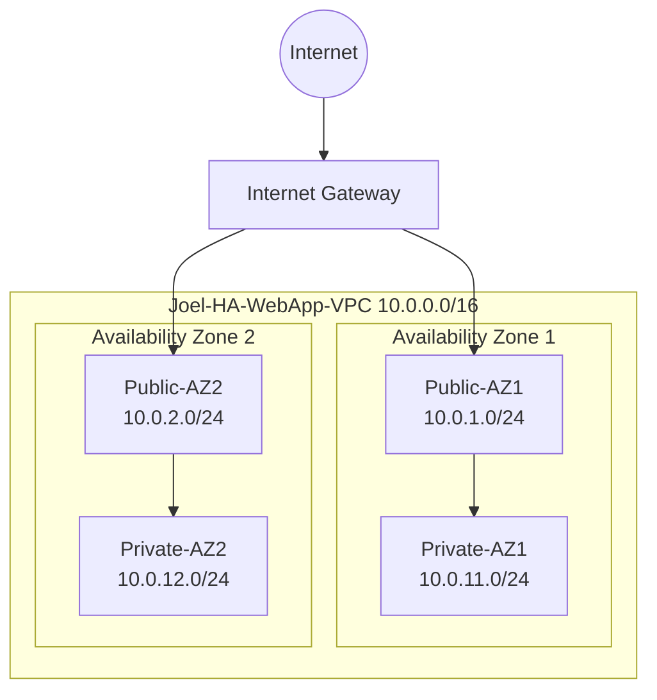
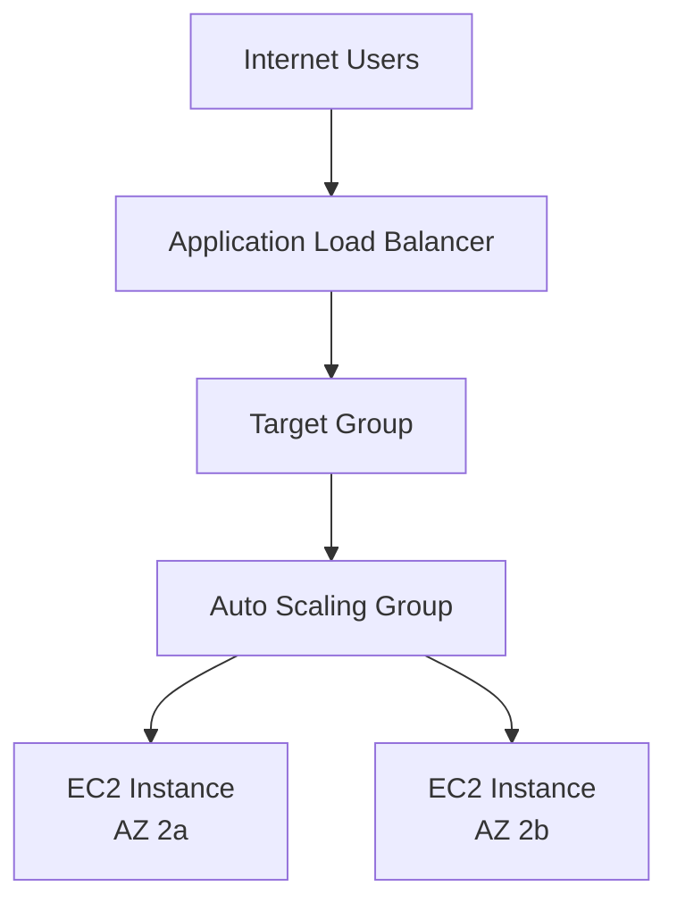

## Project 01 – Highly Available Web Application
This project demonstrates the design and deployment of a highly available web application architecture on AWS using load balancing and auto scaling.

## Objective
Design and deploy a highly available web application architecture in AWS using:

- Custom VPC
- Public and Private Subnets (Multi-AZ)
- Application Load Balancer
- EC2 Auto Scaling Group
- NAT Gateway
- Secure access via SSM (no SSH)

## Goal
Develop practical Solutions Architect reasoning by building real infrastructure and documenting design decisions.

---

This project documents the design, deployment and reasoning behind a production-style highly available AWS architecture.

## Development Environment
- Device: MacBook Air / Desktop Mac
- Git workflow enabled
- AWS CLI configured (ap-southeast-2)

## Architecture Design – VPC Blueprint (Foundation)

### Region
- ap-southeast-2 (Sydney)

### VPC CIDR
- 10.0.0.0/16

### Availability Zones
- Two Availability Zones (for high availability)

### Subnet Strategy (4 total)

| AZ  | Public Subnet | Private Subnet |
|-----|--------------|---------------|
| AZ1 | 10.0.1.0/24  | 10.0.11.0/24  |
| AZ2 | 10.0.2.0/24  | 10.0.12.0/24  |

### Routing Intent
- Public subnets: `0.0.0.0/0 → Internet Gateway`
- Private subnets: `0.0.0.0/0 → NAT Gateway`

### NAT Strategy

For learning purposes, this lab currently **does not deploy a NAT Gateway**.

NAT Gateways incur a constant hourly charge, so they were intentionally excluded during the early stages of this project to keep lab costs minimal while the core networking and load balancing architecture was developed.

At this stage, all compute resources remain in public subnets to allow direct internet access for package installation and updates.

In a production architecture, application servers would normally be placed in **private subnets** with outbound internet access provided through a **NAT Gateway**.

Best practice in production environments is to deploy **one NAT Gateway per Availability Zone** to avoid cross-AZ dependencies and improve resilience.

A NAT Gateway will be introduced later in this project when the architecture evolves to include:

- private application servers
- Auto Scaling Groups
- controlled outbound internet access

## Network Architecture

VPC: 10.0.0.0/16

AZ1
- Public-AZ1 10.0.1.0/24
- Private-AZ1 10.0.11.0/24

AZ2
- Public-AZ2 10.0.2.0/24
- Private-AZ2 10.0.12.0/24

Public route table:
0.0.0.0/0 → Internet Gateway

Private route table:
0.0.0.0/0 → NAT Gateway (when NAT is present)

## Design Decisions

The VPC uses a /16 CIDR block to allow future growth of the subnet structure if the application expands. This provides a large address space while remaining manageable.

The architecture spans two Availability Zones to provide high availability and resilience. Each zone contains both a public and private subnet. The public subnets host internet-facing components such as load balancers, while the private subnets host application compute that should not be directly accessible from the internet.

Public route tables direct external traffic to the Internet Gateway, while the private subnets remain isolated inside the VPC unless outbound access is provided through a NAT Gateway or VPC endpoints.

## Network Architecture Diagram



## Web Server Deployment

A public EC2 instance was launched in the `Public-AZ1` subnet to host a temporary web server for development and testing.

The instance was configured with an IAM role allowing access through AWS Systems Manager (SSM), avoiding the need for SSH access.

Nginx was installed and started on the instance to act as a simple HTTP web server.

Once HTTP access was allowed in the security group, the default Nginx welcome page was successfully served over the internet using the instance’s public IP address.

This confirmed the network routing, internet gateway, security group configuration, and EC2 instance were functioning correctly.

### Verification

The web server was tested by accessing the instance’s public IP from a browser, which returned the default Nginx welcome page.

This confirmed that:

- HTTP traffic is allowed through the security group
- Nginx is running correctly on the EC2 instance
- The instance is reachable via the internet gateway

---

## Application Load Balancer Deployment

To move towards a production-style architecture, an **Application Load Balancer (ALB)** was introduced in front of the web server.

Rather than allowing users to connect directly to the EC2 instance, traffic now flows through the load balancer first. This approach allows the architecture to scale to multiple backend instances and improves availability.

The ALB distributes incoming requests to registered targets within a target group.

### Traffic Flow

```
Internet → Application Load Balancer → Target Group → EC2 Web Server → Nginx → Web Page
```

---

## Target Group Configuration

A target group was created to register backend instances that will receive traffic from the load balancer.

| Setting | Value |
|--------|------|
| Target Group Name | `joel-webapp-tg` |
| Target Type | Instance |
| Protocol | HTTP |
| Port | 80 |
| VPC | `Joel-HA-WebApp-VPC` |

The EC2 instance **Joel-WebApp-VPC-Public-Server** was registered as the first target.

Health checks confirmed the instance was **healthy**, indicating that Nginx was responding correctly on port 80.

---

## Application Load Balancer Configuration

An internet-facing Application Load Balancer was deployed with the following configuration:

| Setting | Value |
|--------|------|
| Name | `joel-webapp-alb` |
| Scheme | Internet-facing |
| IP Address Type | IPv4 |
| VPC | `Joel-HA-WebApp-VPC` |
| Subnets | Public-AZ1, Public-AZ2 |

Placing the load balancer in **two public subnets across different Availability Zones** ensures that the load balancer itself remains highly available.

---

## Security Group Architecture

Two separate security groups were used to properly control traffic flow.

### ALB Security Group (`joel-alb-sg`)

| Type | Port | Source |
|-----|------|------|
| HTTP | 80 | 0.0.0.0/0 |

This allows internet traffic to reach the load balancer.

### EC2 Web Server Security Group (`joel-webapp-public-sg`)

| Type | Port | Source |
|-----|------|------|
| SSH | 22 | Administrator IP |
| HTTP | 80 | ALB Security Group |

This configuration ensures that web traffic reaches the EC2 instance **only through the load balancer**, rather than directly from the internet.

---

## Listener Configuration

The ALB listener was configured as:

| Protocol | Port | Action |
|---------|------|------|
| HTTP | 80 | Forward to `joel-webapp-tg` |

Incoming HTTP requests are forwarded to the target group which then routes traffic to the registered EC2 instance.

---

## Validation

The architecture was tested by accessing the **ALB DNS endpoint** in a browser:

```
http://joel-webapp-alb-130875726.ap-southeast-2.elb.amazonaws.com
```

The request successfully returned the custom web page:

```
Joel McLean Cloud Lab
High Availability Web App Running on AWS
```

This confirmed the full traffic path was operating correctly:

```
Internet → ALB → Target Group → EC2 → Nginx → Web Page
```

---

## Key Learning Points

Building this stage of the architecture highlighted several important AWS concepts:

- Application Load Balancers must be placed in **public subnets**
- Each Availability Zone requires its own subnet
- Subnets are only considered public if their route table includes a route to the **Internet Gateway**
- Security groups should enforce proper traffic flow:
  
```
Internet → ALB → EC2
```

- When troubleshooting load balancer issues it is important to verify:
  - target group health
  - security group rules
  - subnet routing
  - whether the application is actually running on the instance

---

## Next Stage

The current design routes traffic to a **single EC2 instance**.

The next phase of the architecture will introduce:

- **Multiple EC2 instances**
- **Auto Scaling Groups**
- **Private subnet application servers**
- **NAT Gateway for outbound internet access**

This will allow the architecture to achieve true **high availability and automatic scaling**.

---

## Auto Scaling Implementation

To achieve true high availability, the architecture was extended with an **EC2 Auto Scaling Group (ASG)**.

Instead of relying on a single EC2 instance, the application now runs on multiple instances managed automatically by AWS.

A **Launch Template** defines the instance configuration, including:

- instance type
- AMI
- security groups
- user data script that installs and starts Nginx

When new instances launch, they automatically configure themselves as web servers.

### Auto Scaling Configuration

| Setting | Value |
|-------|------|
| Auto Scaling Group | `joel-webapp-asg` |
| Launch Template | `joel-webapp-template` |
| Desired Capacity | 2 |
| Minimum Capacity | 2 |
| Maximum Capacity | 2 |
| Target Group | `joel-webapp-tg` |

The Auto Scaling Group spans **multiple Availability Zones**, ensuring that if an instance fails in one zone, a replacement instance can be launched automatically.

---

## Self-Healing Infrastructure Test

To verify that the architecture was functioning correctly, an EC2 instance was manually terminated.

The following behaviour was observed:

1. One EC2 instance was terminated.
2. The Auto Scaling Group detected that the number of running instances dropped below the desired capacity.
3. AWS automatically launched a replacement instance.
4. The new instance registered with the target group.
5. Health checks passed and traffic continued flowing through the load balancer.

During this process the web application remained accessible through the load balancer.

This confirmed that the architecture is **self-healing** and capable of automatically recovering from instance failures.

---

## Updated Traffic Flow

With Auto Scaling in place, the application now follows this architecture:



This architecture provides:

* improved availability
* automatic instance replacement
* the foundation for horizontal scaling


---

## Future Improvements

Several improvements could further enhance the architecture:

- Enable **HTTPS** using AWS Certificate Manager
- Implement **CloudWatch scaling policies**
- Move application servers to **private subnets**
- Introduce **NAT Gateway** or **VPC Endpoints** for controlled outbound access
- Deploy infrastructure using **Infrastructure as Code (Terraform or CloudFormation)**

These enhancements would bring the architecture closer to a production-grade AWS environment.